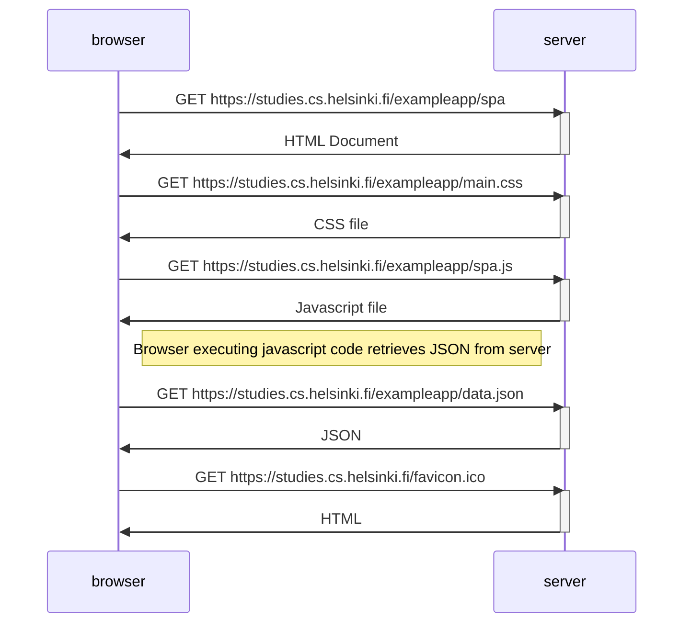

```mermaid
sequenceDiagram
    participant browser
    participant server

    browser ->> server: GET https://studies.cs.helsinki.fi/exampleapp/spa
    activate server
    server ->> browser: HTML Document
    deactivate server

    browser ->> server: GET https://studies.cs.helsinki.fi/exampleapp/main.css
    activate server
    server ->> browser: CSS file
    deactivate server

    browser ->> server: GET https://studies.cs.helsinki.fi/exampleapp/spa.js
    activate server
    server ->> browser: Javascript file
    deactivate server

    Note right of browser: Browser executing javascript code retrieves JSON from server

    browser ->> server: GET https://studies.cs.helsinki.fi/exampleapp/data.json
    activate server
    server ->> browser: JSON
    deactivate server

    browser ->> server: GET https://studies.cs.helsinki.fi/favicon.ico
    activate server
    server ->> browser: HTML
    deactivate server
```